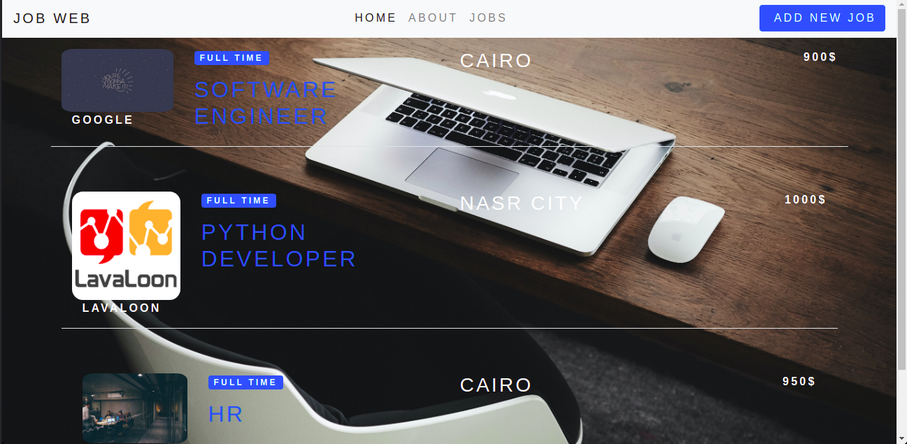
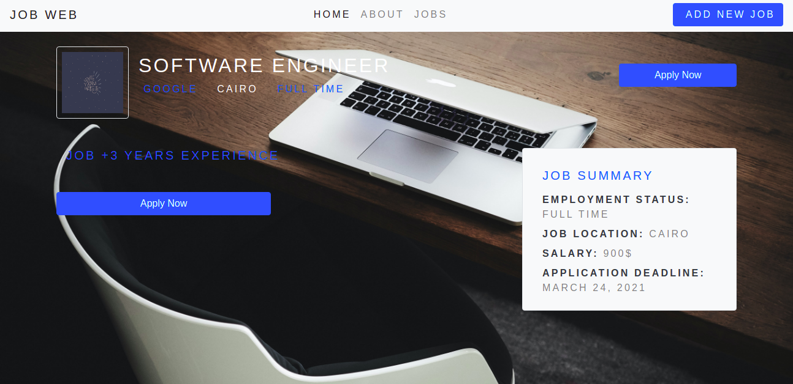
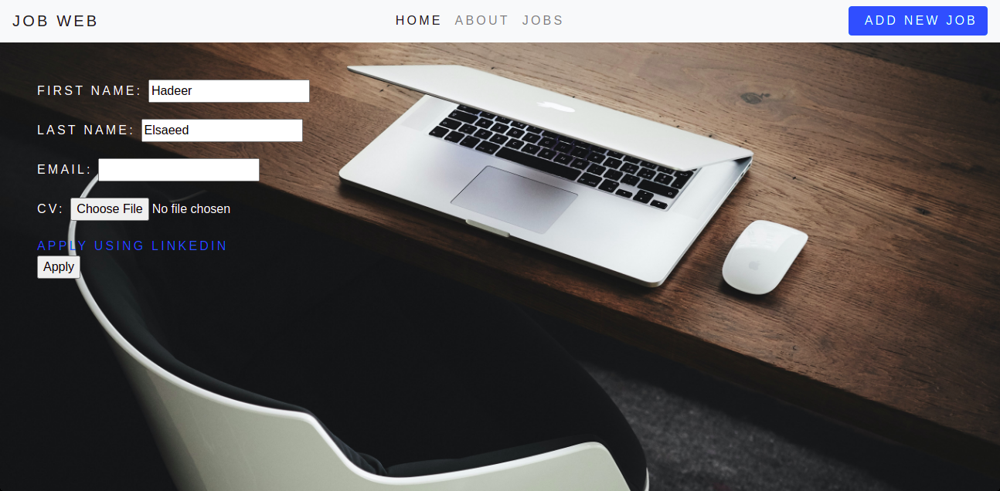
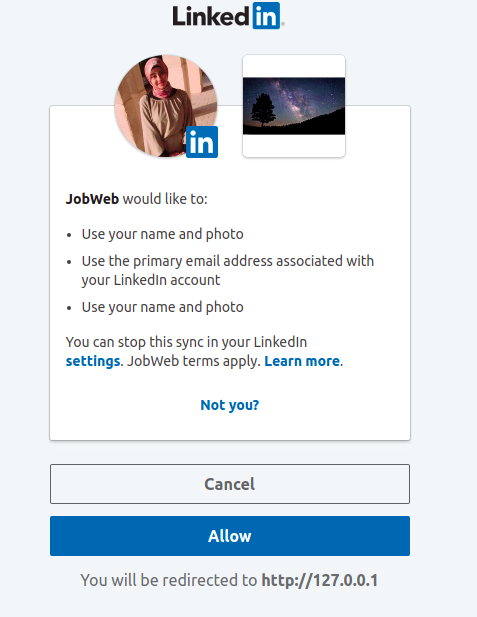

# Job-Advertising-Web-Page

## To run this project
clone the project.

create and start a a virtual environment. " virtualenv env --no-site-packages " " source env/bin/activate "

Install all dependencies. " pip install -r requirements.txt "

cd into the project's home directory.

run server " python manage.py runserver "

I use postman to test all endpoints
